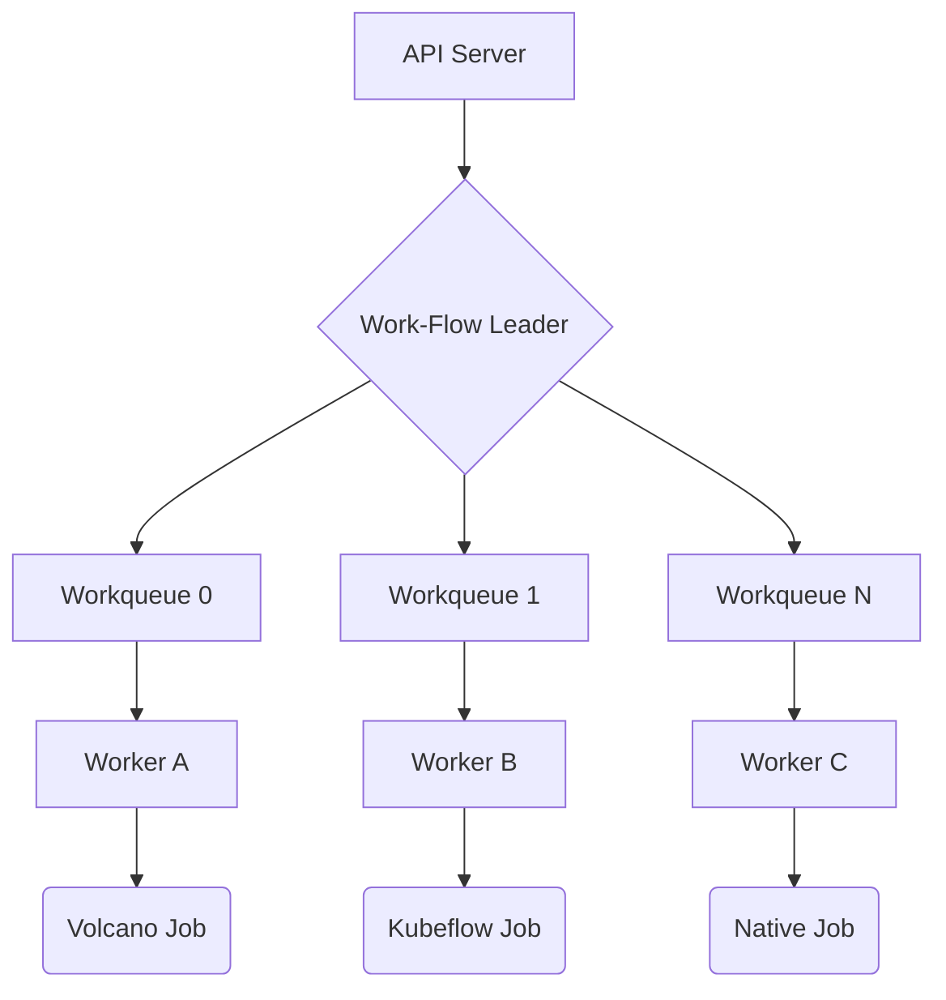

# Work-Flow

Work-Flow is a high-performance, cloud-native workflow engine built on Kubernetes, focused on orchestrating Batch jobs, AI training tasks, and complex data pipelines. It allows users to manage sophisticated task dependencies and lifecycle events through intuitive YAML configurations.

## 🚀 Core Features

- **🌈 Multi-Workload Orchestration**:
  - **Batch Job**: Optimized support for high-performance batch processing and generic jobs.
  - **AI & ML**: Native integration with Kubeflow (PyTorchJob, MPIJob, PaddleJob, etc.).
  - **K8s Native**: Support for standard resources like Deployments and custom CRDs.

- **🛠 Advanced Flow Control**:
  - **SuccessPolicy**: Flexible workflow success criteria (**All**, **Any**, **Critical**). Handle error-recovery and multi-path scenarios gracefully.
  - **Probe**: Dynamic flow control via HTTP, TCP, or task status checks. Supports multi-replica synchronization.
  - **Parallel For**: Concurrent execution of task replicas with index injection.
  - **Retry**: Robust task-level retry policies with backoff.

- **🎭 Dynamic Configuration**: Inject logic via **Patching** to reuse templates with runtime variables.

- **🛡 Robustness**: Built-in idempotency, state awareness, and automated failure recovery.

## 🏗 Architecture & High Performance

Work-Flow is designed for enterprise-grade reliability and massive throughput.

### ⚡ High Concurrency

The controller utilizes a **Sharded Workqueue Architecture** to maximize CPU utilization and eliminate lock contention:

- **Horizontal Sharding**: Tasks are hashed by `Namespace/Name` and distributed across multiple worker threads.
- **Configurable Parallelism**: Scale processing power by adjusting the `--workers` flag.

### 🛡 High Availability (HA)

Support for mission-critical deployments:

- **Leader Election**: Deploy multiple replicas to ensure no single point of failure.
- **State Resilience**: Seamlessly resume workflow execution from the last synchronized state after a failover.



## 🛠 Installation

1. **Install CRDs**:

   ```bash
   make install-crds
   ```

2. **Deploy Controller & Admission**:

   ```bash
   kubectl apply -f installer/controller/
   ```

## 📖 Quick Start

### Basic DAG Example

Deploy a simple task graph:

```bash
make deploy-example
```

### Premium Advanced Demo

Explore advanced features like `Probe`, `For`, and mixed training workloads:

```bash
make deploy-advanced-example
```

## 🏗 Developer Guide

- **Build Binary**: `make build`
- **Unit Tests**: `make test`
- **Container Images**: `make images` (Builds and pushes both Controller and Webhook)

## 📁 Project Structure

- `pkg/apis`: API definitions and CRD schemas.
- `pkg/controllers`: Refactored, modular controller logic (Dependency, Status, Control).
- `pkg/webhooks`: Admission control for workflow validation and mutation.
- `installer`: Production-ready deployment manifests.
- `examples`: Rich collection of YAML patterns.

## 📄 License

Copyright 2026 zhaizhicheng. Licensed under the Apache License, Version 2.0.
