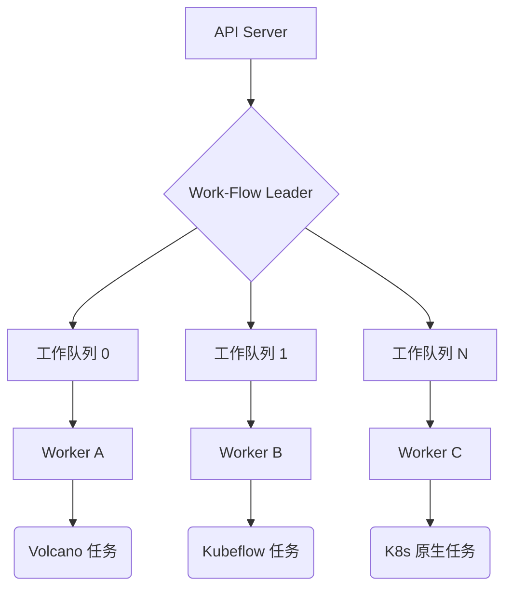

# Work-Flow

Work-Flow 是一个构建在 Kubernetes 之上的高性能、云原生工作流引擎，专注于批处理任务、AI 训练任务（深度学习）以及复杂数据流水线的编排。它允许用户通过直观的 YAML 配置来管理复杂的任务依赖关系和生命周期事件。

## 🚀 核心特性

- **🌈 多工作负载支持**:
  - **Batch Job**: 深度集成高性能批处理任务和通用作业。
  - **AI 训练支持**: 原生支持 Kubeflow 框架（PyTorchJob, MPIJob, PaddleJob 等）。
  - **K8s 原生资源**: 支持 Deployment 等标准资源及自定义 CRD。

- **🛠 高级流程控制**:
  - **Probe (探测器)**: 基于 HTTP、TCP 或任务状态的动态流控。支持多副本同步探测。
  - **Parallel For (并行循环)**: 支持任务副本的并行执行，并具备索引注入能力。
  - **Retry (自动重试)**: 灵活的任务级重试策略及指数退避。

- **🎭 动态配置 (Patch)**: 在引用模板时通过 **Patch** 动态注入配置，实现模板的高度复用。

- **🛡 健壮性**: 内置幂等性管理、完善的状态机感知以及自动故障恢复。

## 🏗 架构设计与高性能特性

Work-Flow 专为企业级稳定性和超大规模吞吐量而设计。

### ⚡ 巅峰级的并发处理 (High Concurrency)

控制器采用了 **分片工作队列架构 (Sharded Workqueue Architecture)**，以最大化 CPU 利用率并消除锁竞争：

- **水平分片**：任务根据 `Namespace/Name` 进行哈希，并均匀分布到多个工作线程。
- **配置化并行**：通过调整 `--workers` 启动参数，即可灵活扩展处理能力。

### 🛡 高可用性保障 (High Availability)

为关键任务流程提供有力支撑：

- **Leader Election**：支持多副本部署，通过主备选举机制消除单点故障。
- **状态韧性**：在发生故障切换后，系统能从最后同步的状态平滑恢复执行流。



## 🛠 安装与部署

1. **安装 CRD**:

   ```bash
   make install-crds
   ```

2. **部署控制器与 Webhook**:

   ```bash
   kubectl apply -f installer/controller/
   ```

## 📖 快速开始

### 基础 DAG 示例

部署一个简单的任务流图：

```bash
make deploy-example
```

### 高级进阶演示 (Premium Advanced Demo)

探索 `Probe`、`For` 循环以及混合 AI 训练任务等高级特性：

```bash
make deploy-advanced-example
```

## 🏗 开发指南

- **构建二进制**: `make build`
- **运行单元测试**: `make test`
- **构建并推送镜像**: `make images` (同时构建控制器和 Admission 镜像)

## 📁 项目结构

- `pkg/apis`: API 定义与 CRD Schema。
- `pkg/controllers`: 重构后的模块化控制器逻辑（依赖管理、状态聚合、任务控制）。
- `pkg/webhooks`: 准入控制逻辑，负责工作流的验证与变更。
- `installer`: 生产级部署配置清单。
- `examples`: 丰富的 YAML 配置模式示例。

## 📄 许可证

Copyright 2026 zhaizhicheng. 采用 Apache License, Version 2.0 许可证。
