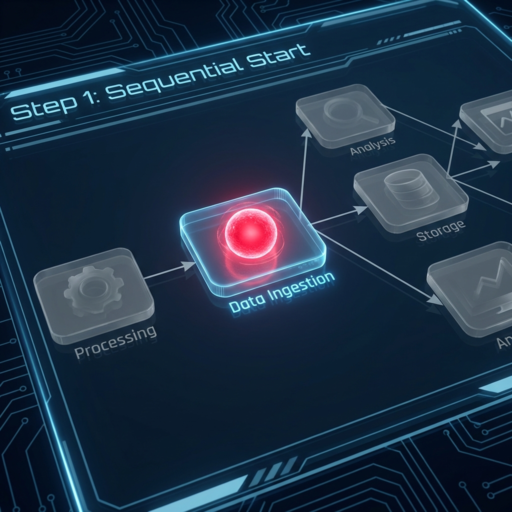
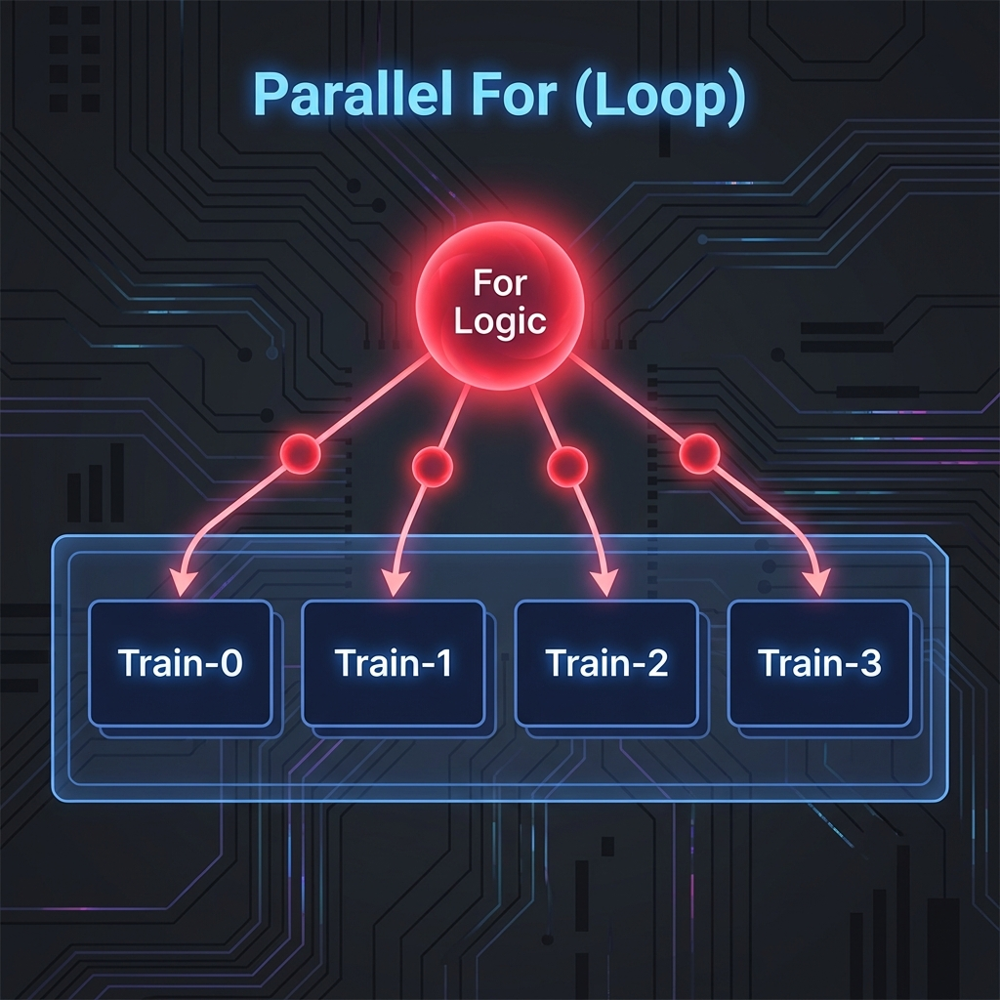
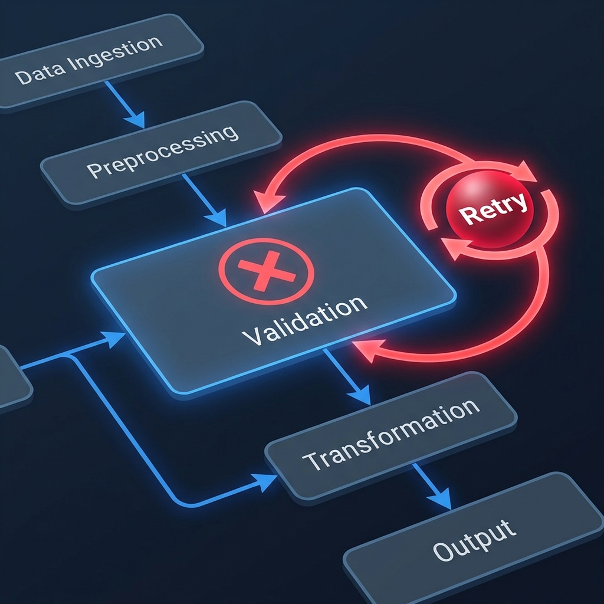
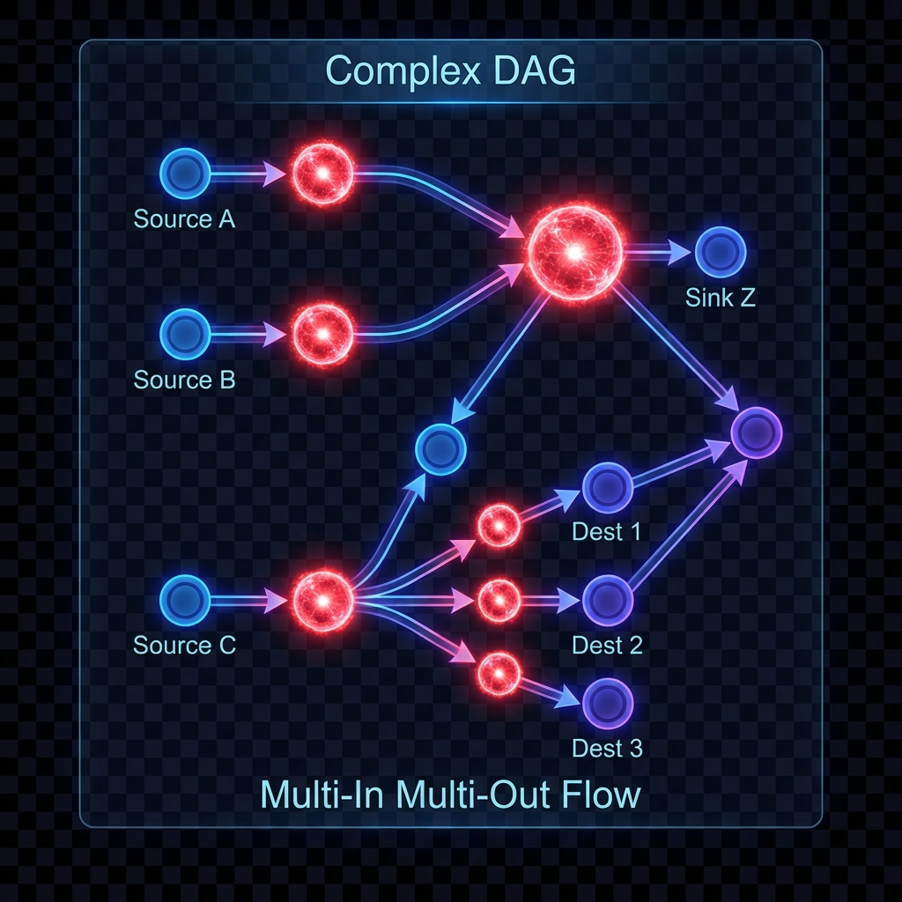
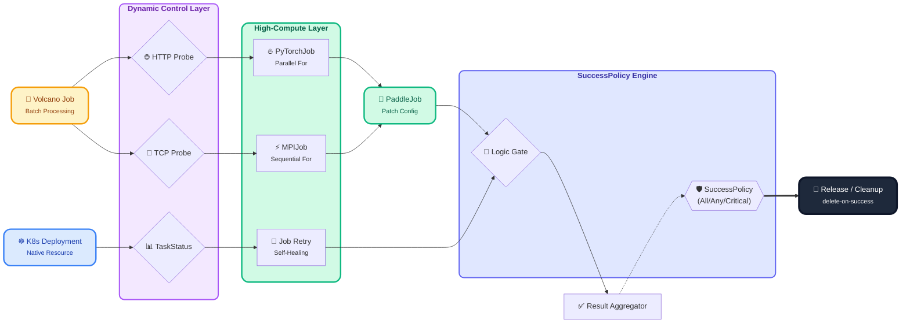
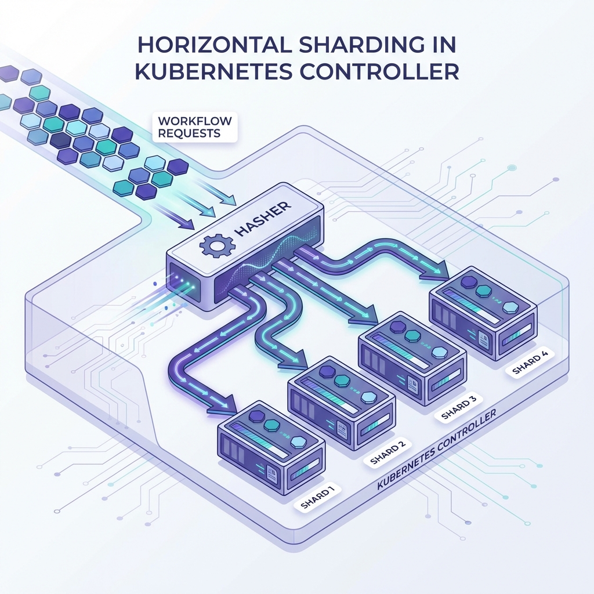
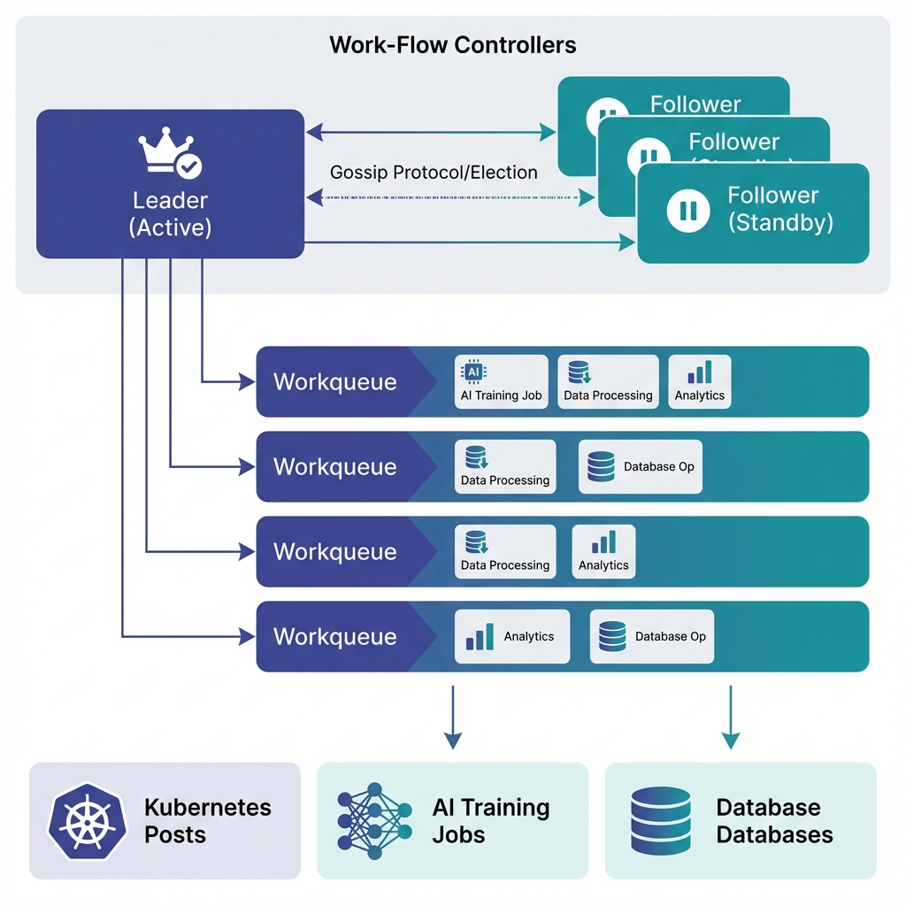

# 🚀 Work-Flow：云原生时代的智能任务编排引擎 —— 让复杂管线回归简单

在 AI 训练、大数据处理和自动化运维日益复杂的今天，如何高效、可靠地编排成百上千个具有依赖关系的计算任务？如何确保引擎在超大规模并发下依然稳定？

**Work-Flow** 应运而生 —— 这是一个为 Kubernetes 深度定制、高性能、可扩展的轻量级云原生工作流引擎。它可以管理从简单的批处理任务到复杂的分布式 AI 训练流水线。

---

## 📺 工作流执行场景演示 (以红色光球代表任务启动)

为了让您能够身临其境地理解 Work-Flow 的执行逻辑，我们通过“红色光球”代表当前活跃任务，展示各种复杂场景下的调度逻辑。

### 1. 顺序启动 (Sequential)


任务按照依赖关系精准有序地开启。红色光球在首个节点跳动，代表正在进行的数据摄取。

### 2. 并行循环 (For Logic)


当进入 `For` 逻辑时，主光球会瞬间分裂成多个子光球，并行驱动多个训练任务（如 `Train-0` 到 `Train-3`）。

### 3. 自动重试 (Retry)


遇到瞬时故障（红色 X）时，Work-Flow 会自动捕获异常。光球会顺着重试路径再次进入任务节点，确保存量任务不丢失。

### 4. 条件判断与探测 (Probe)


光球通过 `Probe` 检测点。根据实时的 HTTP/TCP 或任务状态反馈，动态选择“成功”或“失败”分支，实现智能化路径切换。

### 5. 复杂 DAG (Multi-In/Out)


展示了多任务聚合（多个光球汇聚到一个节点）和多任务分发（一个节点触发多个下游光球）的顶级编排能力。

### 6. 成功策略 (SuccessPolicy)

现在，您可以为工作流定义多样化的成功标准（All, Any, Critical）。光球不再必须走完所有路径，只要满足关键节点的成功条件，整个工作流即可瞬间“通关”！

---

## 🎨 强大的逻辑表现力：支持复杂编排场景

Work-Flow 不仅支持基础的串行与并行，更具备处理极度复杂业务逻辑的能力。以下是典型的“多入口、带决策反馈和循环”的复杂 DAG 演示：

### 全能力动态流转演示

以下演示完整展现了 Work-Flow 的所有核心能力，从多工作负载支持到高级流控逻辑。



**能力说明：**

| 能力         | 演示节点                                                    | 说明                                         |
|--------------|-------------------------------------------------------------|----------------------------------------------|
| **多工作负载** | Volcano Job, K8s Deployment, PyTorchJob, MPIJob, PaddleJob | 支持 Volcano、Kubeflow 全家族及 K8s 原生资源 |
| **探测机制**   | HTTP/TCP/TaskStatus Probe                                   | 三重健康检查确保依赖可靠性                   |
| **并行循环**   | PyTorchJob (4 副本), MPIJob (3 副本)                        | Parallel For 支持并行/顺序副本启动           |
| **重试策略**   | 失败任务 (3 次重试, 5s 间隔)                                 | 自动故障恢复与指数退避                       |
| **动态补丁**   | PaddleJob + Patch                                           | 运行时注入配置，模板高度复用                 |
| **复杂依赖**   | OR 逻辑 (Group 1 AND Group 2)                               | 支持 AND/OR 组合的依赖编排                   |
| **成功策略**   | **SuccessPolicy (All/Any/Critical)**                        | 灵活定义工作流成功标准，适应容错与多路径场景 |
| **生命周期**   | delete-on-success                                           | 成功时清理，失败时保留现场                   |

---

## 🏗 企业级核心优势

### ⚡ 巅峰级的并发处理 (High Concurrency)

Work-Flow 专为超大规模吞吐量设计，采用了 **分片工作队列架构 (Sharded Workqueue Architecture)**：



* **硬件压榨**：任务根据 `Namespace/Name` 进行一致性哈希，均匀分布到多个独立的工作线程，最大化 CPU 利用率并彻底消除锁竞争。
* **无限扩展**：只需简单调整 `--workers` 参数，即可线性提升控制器处理百万级并发任务的能力。

### 🛡 全集群高可用保障 (High Availability)

为生产环境的关键路径提供“永不断线”的支撑：



*   **Leader Election**：原生支持多副本部署，通过 Kubernetes Lease 机制进行主备选举。
*   **无损自愈**：一旦主节点发生故障，备用副本秒级接管，并基于当前集群状态平滑恢复所有执行流，确保工作流进度不丢失。

---

## 🔥 为什么选择 Work-Flow？

### 1. 🌈 全场景负载支持，不才是 Batch

*   **AI 训练加速**：原生支持 Kubeflow 家族（PyTorchJob, MPIJob, TFJob 等），轻松管理分布式训练。
*   **Volcano 调度集成**：深度结合 Volcano，为大规模 Batch 任务提供极致的资源调度。
*   **高度通用性**：支持任何自定义 CRD 资源。

### 2. 🎭 动态模板与 Patching：极致的复用效率

通过 **WorkTemplate** 实现任务定义的标准化，再配合 **Patching** 技术在运行时动态注入变量。您可以像搭建积木一样，通过一套模板组合出无数种业务场景。

### 3. 🛡 灵活的资源治理与判定

*   **智能成功标准 (SuccessPolicy)**：不再局限于“必须全成”。支持全量成功、任一路径成功或仅关键节点成功的灵活判定。
*   **资源自动回收**：支持 **`delete-on-success`** 策略。该策略确保在成功时自动清理 Job 以节省存储，而在失败时保留现场以便快速调试。

---

## ⚡ 极速起步

```bash
# 1. 一键安装 CRD
make install-crds

# 2. 部署控制器
kubectl apply -f installer/controller/

# 3. 运行示例
make deploy-advanced-example
```

---

## 🌟 加入我们

**Work-Flow** 致力于打造最懂开发者的云原生编排工具。如果您正在寻找一个既有性能保证、又足够灵活轻量的任务管线方案，Work-Flow 正和您的心意！

👉 **GitHub 项目地址**: [https://github.com/zhaizhch/workflow](https://github.com/zhaizhch/workflow)

*让我们一起，重新定义云原生时代的任务流！*
